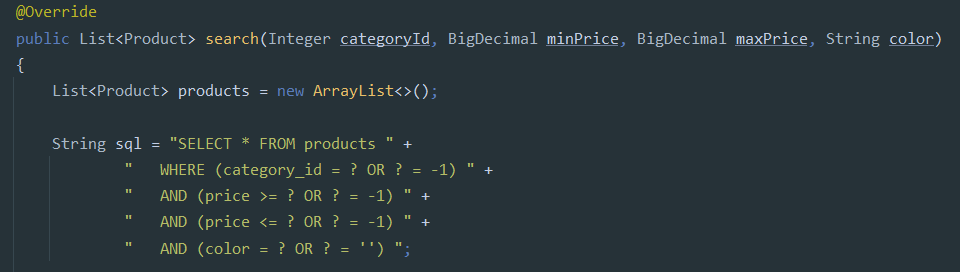
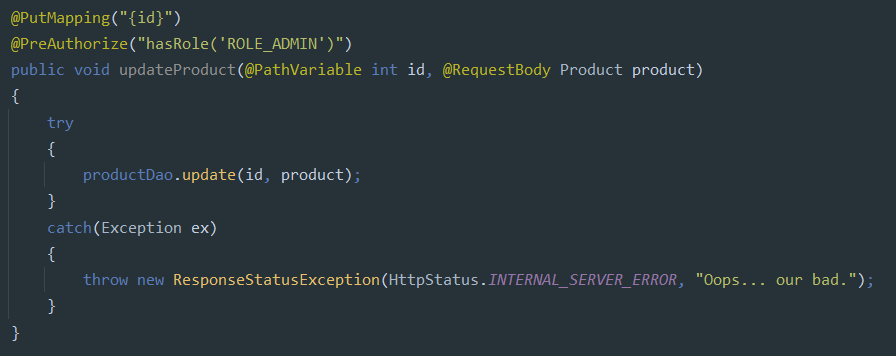
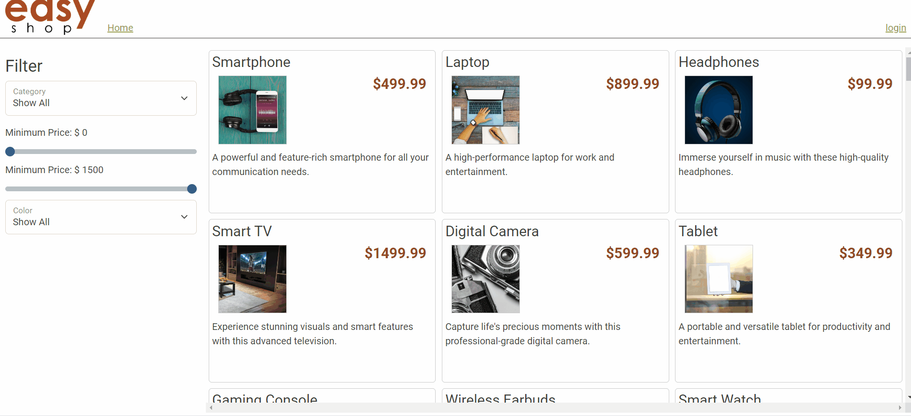
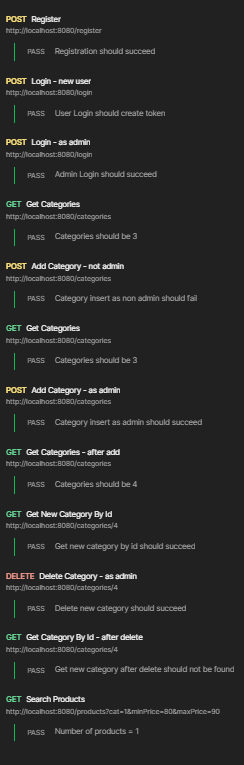

# Ｅａｓｙ Ｓｈｏｐ

Welcome to Easy Shop, your go-to destination for a seamless online shopping experience. This application is powered by a Spring Boot API backend with a MySQL database to ensure functionality and efficient data storage.

## Overview

- [Setup](#setup)

- [Features](#features)

- [Demo](#demo)

- [Endpoint Tests](#endpoint-tests)

## Setup
*Clone the Repository
   ```
   git clone https://github.com/JalesiaGriffin/easyshop-capstone.git
   ```
- Set Up MySQL Database
- Create a MySQL database named `easyshop` by running the `create_database.sql` script in the `database` folder.
- Update `application.properties` with your database credentials.
- Run the Application

### Technologies Used
#### 
Backend framework for building APIs.
#### 
Database for efficient data storage.

## Features

- User Registration and Login

- Product Display by Category, Price, and Color

- Search and Filter

### Bugs
#### Bug 1
##### Included both min and max price values in the query to return accurate results


#### Bug 2
##### Fixed product duplication by using the update method in the ProductDao instead of the create method


## Demo


## Endpoint Tests

